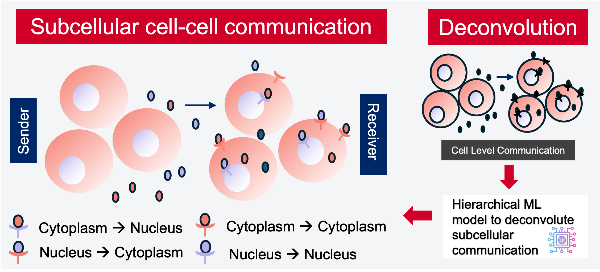
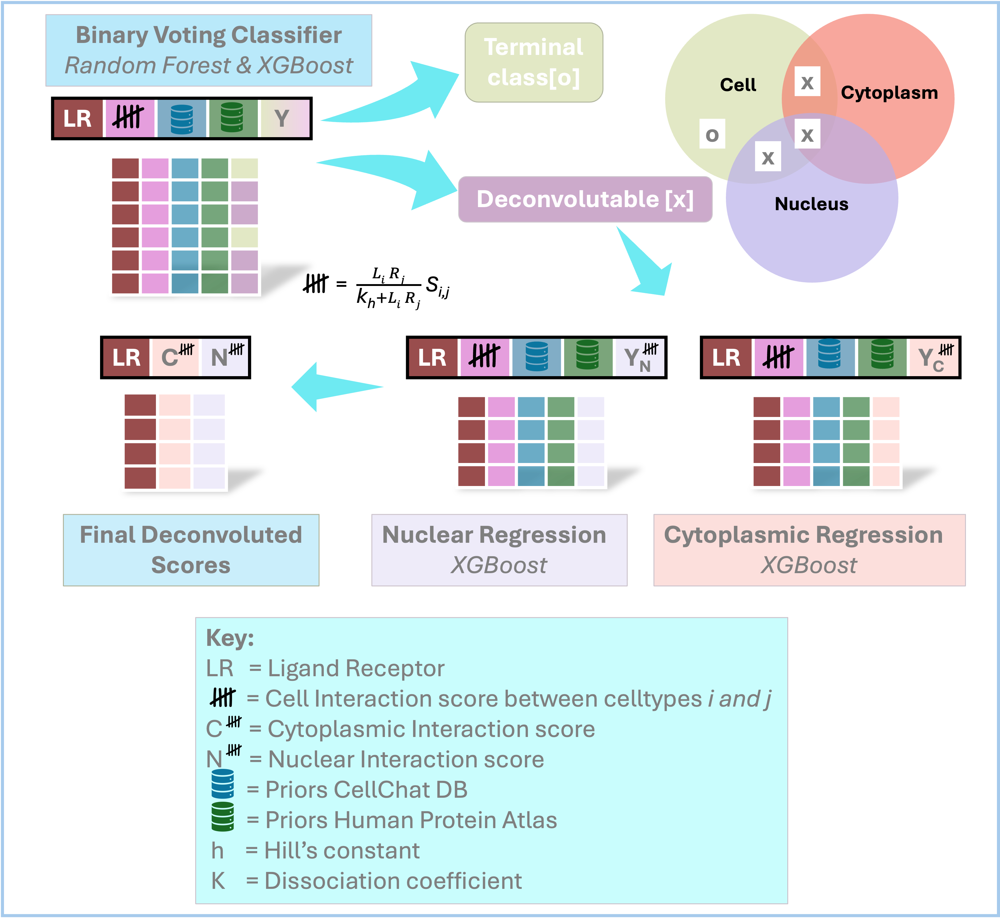

### CCIDeconv: Hierarchical model for deconvolution of subcellular cell-cell interactions in single-cell data

#### Description
A computational model for inferring subcellular cell–cell interactions (CCI) from high-resolution spatial transcriptomics data and single-cell transcriptomics.
This repository provides the model, analysis scripts, and example workflows to:

Deconvolute CCI to subcellular regions from traditional cell-resolved transcriptomics data using a hierarchical machine learning framework.

Reproduce analyses and generate figures from publicly available 10X Xenium datasets across multiple human tissues.

The model enables researchers to pinpoint where signaling is initiated and better interpret downstream pathway activity, offering insights into development, homeostasis, and disease progression.


Figure 1: Schematic of the subcellular CCI.

#### Model Architecture

The model distinguishes nuclear vs cytoplasmic CCI signals using a hierarchical neural network. Inputs are communication scores; outputs are deconvoluted CCI scores.



#### Installation / Requirements

To run the model on example data or your own dataset:
1. Clone the repository 
```bash
git clone https://github.com/SydneyBioX/CCIDeconv.git
```
2. Run the model on your own data or with the example data. Model weights can be downloaded from https://doi.org/10.5281/zenodo.20518900 

``` bash
 cd CCIDeconv
 python evaluate.py \
     --data_path example/example_train_data.csv \
     --categorical_columns lr_pair,source,target,pathway_name,annotation,ligand.family,ligand.keyword,ligand.secreted_type,ligand.transmembrane,receptor.family,receptor.keyword,receptor.surfaceome_main,receptor.surfaceome_sub,receptor.adhesome,receptor.secreted_type,receptor.transmembrane \
     --exclude_columns cyt_pval,cyt_pspatial,cyt_P1,sample,cell_pval,cell_P1,tissue,is_neurotransmitter,ligand_location_cellchat,receptor_location_cellchat,ligand_location_hpa,receptor_location_hpa,nuc_pval,nuc_pspatial,nuc_P1,ligand,receptor\
     --test_data_path example/example_test_data.csv
```
3. (Optional) Explore the notebook:

If you prefer an interactive workflow, you can open example/example_run.ipynb in Jupyter Notebook. It reproduces the same steps as evaluate.py and shows example outputs.
   
